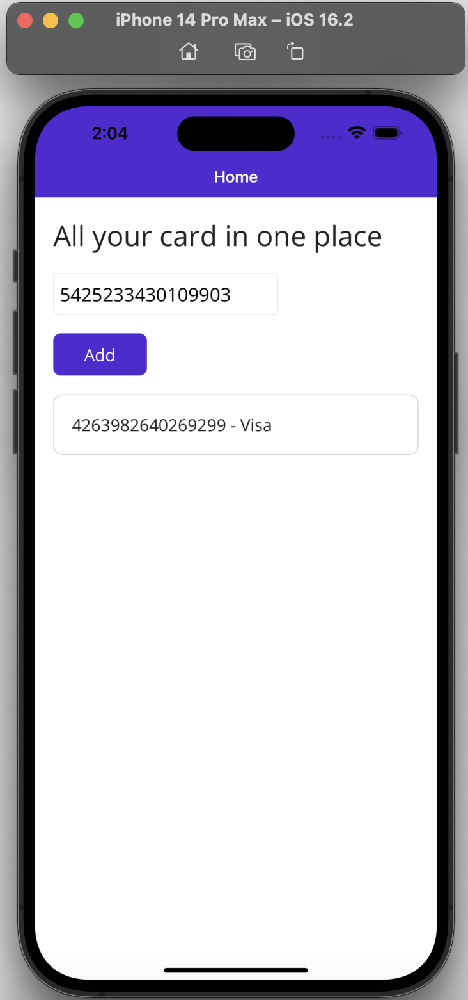

# Card Validator

🔗 [Gihub link](https://github.com/mravaloarison/wallet)

This is a simple `.NET MAUI` application that checks if a credit card number is valid and identifies its type (Visa, MasterCard, Amex or Unknown), based on a project from [Harvard CS50x](https://cs50.harvard.edu/x/2023/psets/1/credit/).

## Requirements
* `XCODE`
* Visual Studio 
* `.NET MAUI`
* Microsoft.Maui.Controls

## Screenshots
<!-- 

 -->
<table>
    <tr>
        <td>
            
        </td>
        <td>
            
        </td>
        <td>
            
        </td>
        <td>
            
        </td>
    </tr>
    <tr>
        <td>
            
        </td>
        <td>
            
        </td>
        <td>
            
        </td>
        <td>
            
        </td>
        <td>
            
        </td>
    </tr>
</table>

## Usage
To use this application, simply run it on your local machine or emulator, and input a credit card number into the text box provided. If the card number is valid, the application will add a label showing the card number and its type (Visa, MasterCard, Amex or Unknown) to the stack layout. If the card number is invalid, the application will display an error message.

## How it works
This application checks if the entered credit card number is valid using the Luhn algorithm. It then identifies the type of the credit card based on the first few digits of the card number. If the card number is valid, a new label is created with the card number and its type, and added to the stack layout.

## Issues encountered
As I was working on a macOS desktop, there was compatibility issues with the macOS version, Xcode and .NET MAUI installation errors, there was also few issues related to dependencies or libraries used. They were mostly resolved by updating the software, reinstalling or repairing the installation, also troubleshooting dependencies and libraries.
